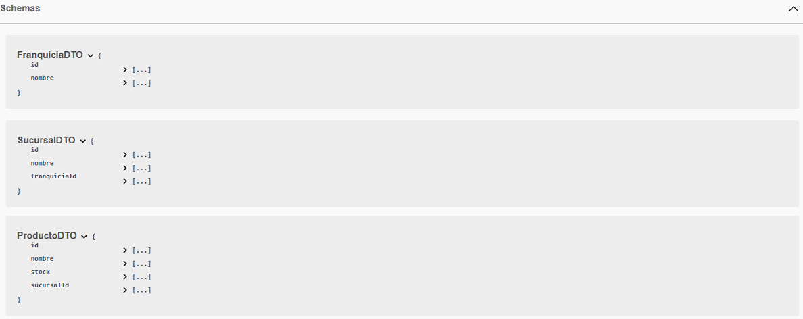
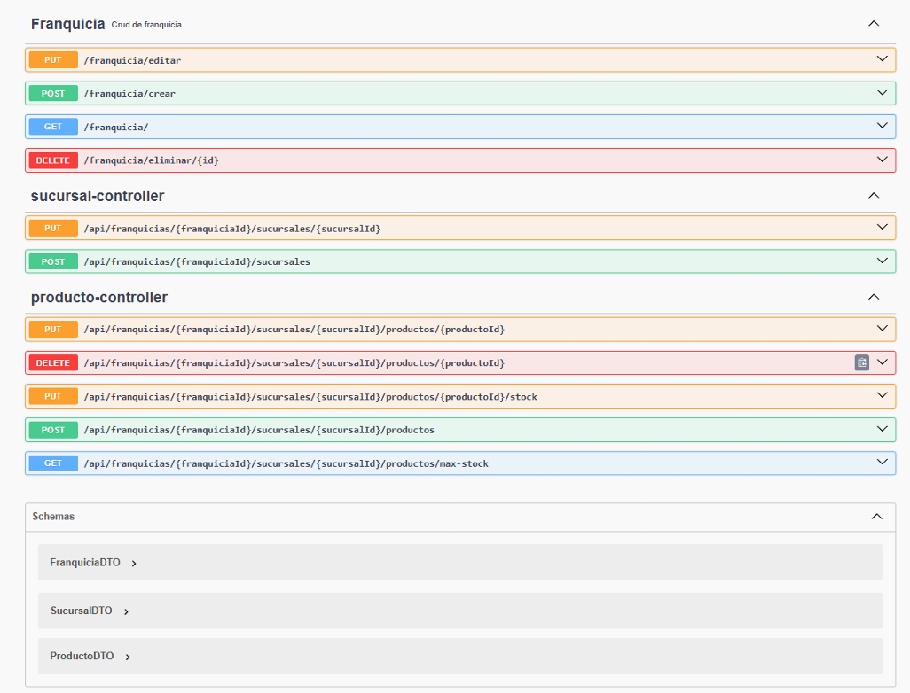
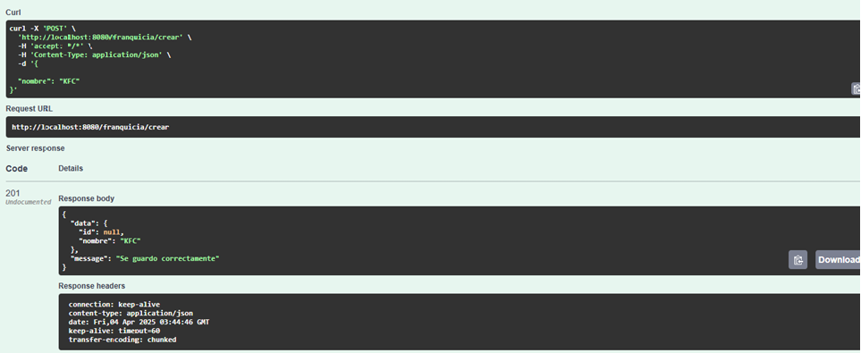
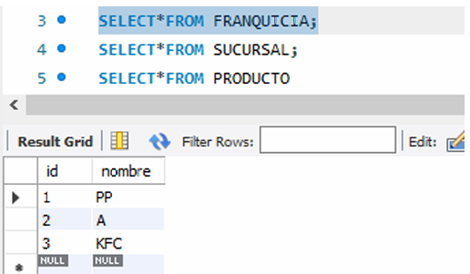
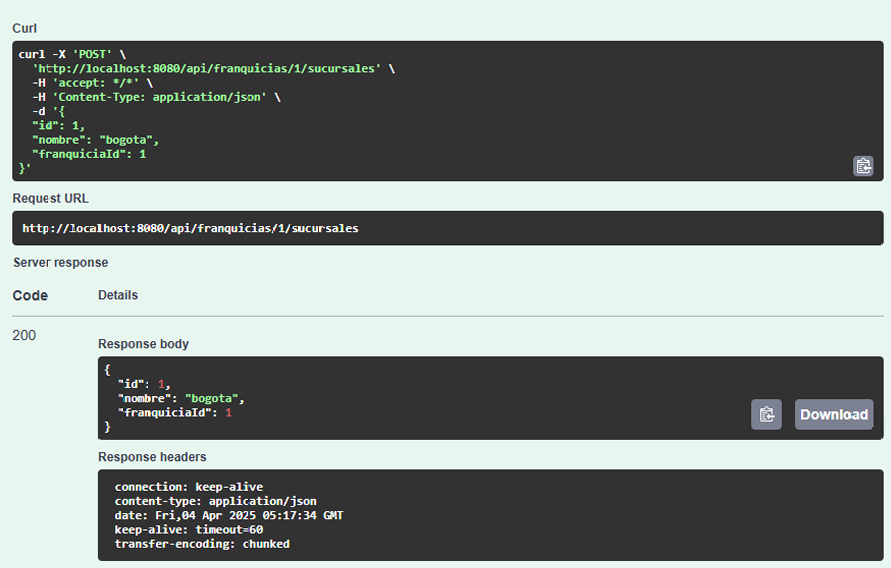

*DESCRIPCION: API para manejar una lista de franquicias, Una franquicia se compone por un nombre y una lista de
sucursales y, a su vez, una sucursal está compuesta por un nombre y un listado de productos ofertados en la sucursal.Un
El producto se compone de un nombre y una cantidad de Stock.

*FUNCIONES
Crear una nueva franquicia.
Obtener una lista de todas las franquicias.
Actualizar el nombre de una franquicia.
Eliminar una franquicia por su ID.
Crear Sucursal
Crear Producto
*ESQUEMA

SOLUCIÓN
1. El proyecto debe ser desarrollado en Sprint Boot 

2. Exponer endpoint para agregar una nueva franquicia

3. Exponer endpoint para agregar una nueva sucursal a la franquicia

