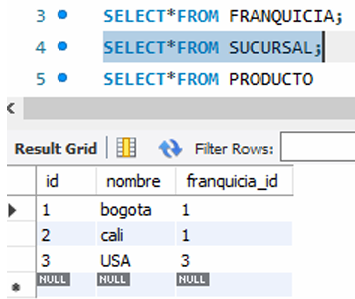
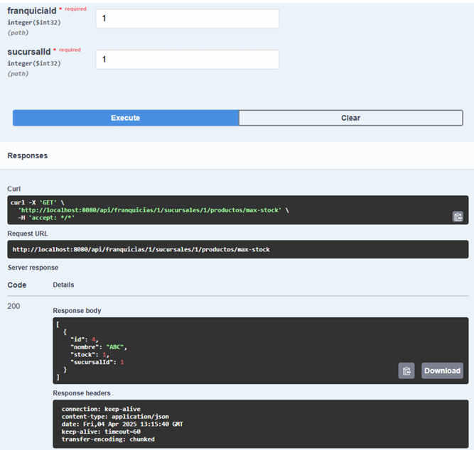

*DESCRIPCION: API para manejar una lista de franquicias, Una franquicia se compone por un nombre y una lista de
sucursales y, a su vez, una sucursal está compuesta por un nombre y un listado de productos ofertados en la sucursal.Un
El producto se compone de un nombre y una cantidad de Stock.

*FUNCIONES
Crear una nueva franquicia.
Obtener una lista de todas las franquicias.
Actualizar el nombre de una franquicia.
Eliminar una franquicia por su ID.
Crear Sucursal
Crear Producto
*ESQUEMA

SOLUCIÓN
1. El proyecto debe ser desarrollado en Sprint Boot 

2. Exponer endpoint para agregar una nueva franquicia

3. Exponer endpoint para agregar una nueva sucursal a la franquicia

4. Exponer endpoint para agregar un nuevo producto a la sucursal

5. Exponer endpoint para eliminar un nuevo producto a una sucursal

6. Exponer endpoint para modificar un Stock de un nuevo producto

7. Exponer endpoint para agregar que permita mostrar cual es el producto que más stock 
tiene por sucursal para una 
franquicia puntual. Debe retomar un listado de productos que indiquen a que sucursal 
pertenece.

8. Utilizar sistemas de persistencia de datos como Redis, MySql, Mongo BD, Dynamo en 
algún proveedor de nube. (mysql)

9. +Plus si se expone endpoint que permita actualizar el nombre de la franquicia.

10. +Plus si se expone endpoint que permita actualizar el nombre de la sucursal.

11. +Plus si se expone endpoint que permita actualizar el nombre del producto.

12. +ELIMINAR FRANQUICIA.

12. +CONSULTAR FRANQUICIA.

PARA PROBAR:

CLONAR PROYECTO,CREAR BD,AJUSTAR application.properties con puerto y usuario

SQL.
create database franquiciasapi;
use franquiciasapi;
SELECT*FROM FRANQUICIA;
SELECT*FROM SUCURSAL;
SELECT*FROM PRODUCTO
